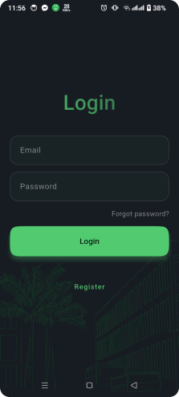
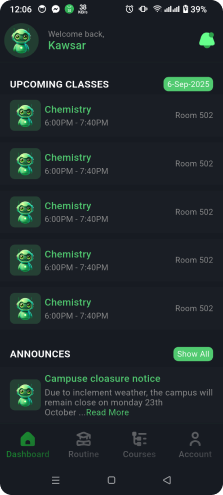
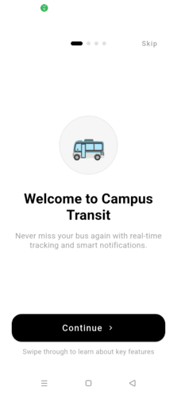
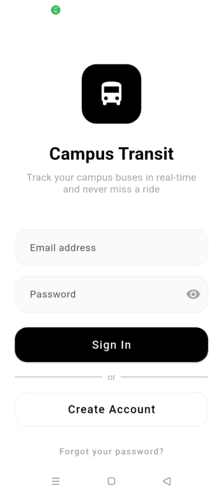
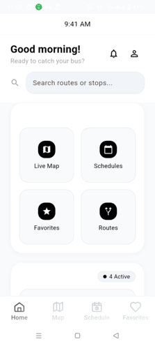
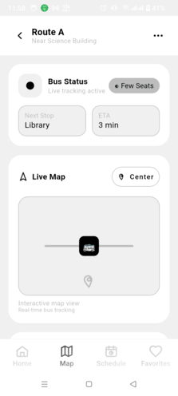
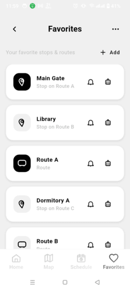

## [Univus](univus/)
**Empowering Minds, Shaping Futures**

Univus is a modern educational companion app designed to streamline your academic journey. From onboarding to course management, Univus provides a seamless experience for students to access routines, courses, and dashboards—all in one place.

  
  
  
  
  
  

## [Uniride](uniride/)
**Connecting Campuses, One Ride at a Time**

Uniride is a campus ride-sharing app designed to make commuting easier and more sustainable for students. Effortlessly find, offer, or join rides within your university community, helping you save time, reduce costs, and build connections.

  
  
  
  
  

